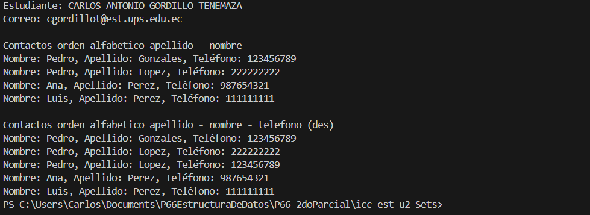
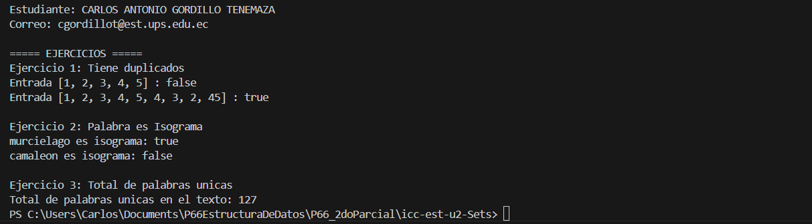

# Proyecto: Ejercicios con Conjuntos (`Set`) en Java

## 📌 Información General

- **Proyecto:** Ejercicios con `HashSet` en Java  
- **Asignatura:** Estructura de Datos  
- **Carrera:** Computación  
- **Estudiante:** Carlos Antonio Gordillo Tenemaza  
- **Fecha:** 03/07/2025  
- **Profesor:** Ing. Pablo Torres

---

## 🛠️ Descripción

Este proyecto contiene ejercicios prácticos que utilizan la clase `HashSet` de Java para trabajar con conjuntos. Los ejercicios se centran en la detección de duplicados, análisis de palabras y conteo de elementos únicos a partir de arreglos y texto.

---

### 🔧 Componentes:

1. **`tieneDuplicado(int[] numeros)`**  
   Verifica si un arreglo contiene números repetidos.

2. **`esIsograma(String palabra)`**  
   Determina si una palabra es un isograma (todas las letras son únicas).

3. **`contarPalabrasUnicas(String frase)`**  
   Cuenta cuántas palabras únicas hay en un texto largo, ignorando puntuación y mayúsculas/minúsculas.

---

---

## 🖼️ Captura de Pantalla






---

## 🚀 Ejecución

Para compilar y ejecutar el programa:

1. Desde la carpeta raíz del proyecto, compila con:

    ```bash
    javac -d bin src/**/*.java
    ```

2. Luego ejecuta la clase principal:

    ```bash
    java -cp bin App
    ```

---

## 🧑‍💻 Ejemplo de Salida

```
===== EJERCICIOS =====
Ejercicio 1: Tiene duplicados
Entrada [1, 2, 3, 4, 5] : false
Entrada [1, 2, 3, 4, 5, 4, 3, 2, 45] : true

Ejercicio 2: Palabra es Isograma
murcielago es isograma: true
camaleon es isograma: false

Ejercicio 3: Total de palabras unicas
Total de palabras unicas en el texto: 127
```