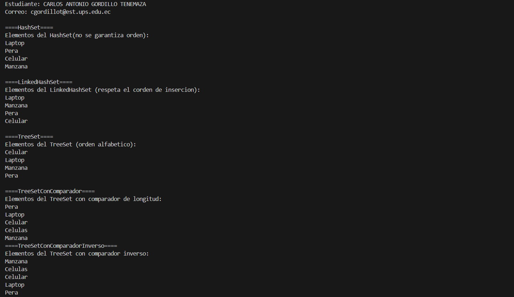

# Práctica de Conjuntos en Java (HashSet, LinkedHashSet, TreeSet)

## 📌 Información General

- **Título:** Práctica de Conjuntos en Java  
- **Asignatura:** Estructura de Datos  
- **Carrera:** Computación  
- **Estudiante:** Carlos Antonio Gordillo Tenemaza 
- **Fecha:** 01/07/2025  
- **Profesor:** Ing. Pablo Torres

---

## 🛠️ Descripción

Este proyecto implementa un sistema en Java para demostrar el uso de distintas implementaciones de la interfaz `Set` del lenguaje Java: `HashSet`, `LinkedHashSet`, `TreeSet`, `TreeSet` con comparador personalizado, y `TreeSet` con comparador inverso. El objetivo es observar cómo se comportan estos conjuntos respecto a duplicados y orden.

### 🔧 Componentes:

- `Controllers.Sets`: contiene métodos que construyen diferentes tipos de `Set`:
  - `construirHashSet()`
  - `construirLinkedHashSet()`
  - `construirTreeSet()`
  - `construirTreeSetConComparador()` → ordena por longitud ascendente y luego alfabéticamente
  - `construirTreeSetConComparadorInverso()` → ordena por longitud descendente y luego alfabéticamente inverso

- `App.java`: clase principal que ejecuta el programa llamando a los métodos estáticos:
  - `runHashSet(Sets sets)`
  - `runLinkedHashSet(Sets sets)`
  - `runTreeSet(Sets sets)`
  - `runTreeSetConComparador(Sets sets)`
  - `runTreeSetConComparadorInverso(Sets sets)`

---

## 🖼️ Captura de Pantalla



---

## 🚀 Ejecución

Para compilar y ejecutar el programa:

1. Desde la carpeta raíz del proyecto, compila con:

    ```bash
    javac -d bin src/**/*.java
    ```

2. Luego ejecuta la clase principal:

    ```bash
    java -cp bin App
    ```

---

## 🧑‍💻 Ejemplo de Salida

```
====HashSet====
Elementos del HashSet(no se garantiza orden): 
Laptop
Pera
Celular
Manzana

====LinkedHashSet====
Elementos del LinkedHashSet (respeta el corden de insercion): 
Laptop
Manzana
Pera
Celular

====TreeSet====
Elementos del TreeSet (orden alfabetico):
Celular
Laptop
Manzana
Pera

====TreeSetConComparador====
Elementos del TreeSet con comparador de longitud:
Pera
Laptop
Celular
Celulas
Manzana

====TreeSetConComparadorInverso====
Elementos del TreeSet con comparador inverso:
Manzana
Celulas
Celular
Laptop
Pera
